# Android Emulator Plugin for Jenkins

Provides numerous features for [Android development](http://developer.android.com/) and testing during Jenkins builds, including:

* Creating Android emulators on-demand
* Running an Android emulator during a build
* Automatically installing the Android SDK on Jenkins agents, where required
* Detecting which Android platforms are required to build one or more projects and installing them automatically
* Generating Ant build files for any app, test, or library projects found in the workspace
* Installing/uninstalling Android packages
* Running the monkey stress-testing tool
* Parsing output from running monkey and marking a build as unstable/failed

Automates many [Android development](https://developer.android.com/)
tasks including SDK installation, build file generation, emulator
creation and launch, APK (un)installation, monkey testing and
analysis...  
See also: [Android Lint
Plugin](https://wiki.jenkins.io/display/JENKINS/Android+Lint+Plugin).  
See also: [Google Play Android Publisher
Plugin](https://wiki.jenkins.io/display/JENKINS/Google+Play+Android+Publisher+Plugin).

#### Table of Contents

## Features

This plugin lets you automate a number of Android-related tasks during a
build:

-   Creating a new Android emulator
    -   Its configuration can be parameterised, including OS version,
        screen size, locale and hardware properties
    -   Android SDK dependencies are automatically downloaded and
        installed
-   Running any Android emulator
    -   Waits until the emulator is fully started-up
    -   Emulator snapshots can be automatically created
        -   This allows a very fast startup time for subsequent builds
        -   This ensures subsequent builds will start from the same
            clean state
    -   Logs are automatically captured and saved
    -   Emulator will be shut down automatically when the build has
        finished
    -   Multiple instances of the same emulator are prevented from
        running concurrently
-   Detecting which Android platforms are required to build one or more
    projects and installing them automatically
-   Generating Ant build files for any app, test or library projects
    found in the workspace
-   Installing an Android package onto an emulator
-   Uninstalling an Android package from an emulator
-   Running the `monkey` stress-testing tool
-   Parsing output from running `monkey`
    -   The build outcome can be automatically marked as unstable or
        failed in case a monkey-induced crash is detected

## Requirements

### Jenkins

Jenkins [version 2.479.1](https://jenkins.io/changelog/#v2.479.1) or newer is required.

### Android

The plugin will automatically download and install the [Android
SDK](https://developer.android.com/sdk/), if it's not already installed
when a build starts.  
This means that no manual effort is required to start running Android
emulators with Jenkins.

You can, however, disable automated installation via the "Automatically
install Android components when required" option on the main Jenkins
configuration page.

View manual SDK installation requirements...

If you install the Android SDK yourself, you must install at least two
further components, via the [Android SDK and AVD
Manager](https://developer.android.com/sdk/installing.html#components):

-   SDK Tools
-   SDK Platform-tools

If you only wish to run pre-existing emulator instances (aka Android
Virtual Devices, or AVDs), there are no further requirements — only
these two components are required.

If you want the plugin to automatically generate new emulator instances,
but disable auto-installation, you must install one or more Android
platform versions into the SDK.  
By default, the SDK only comes with the bare minimum; in this case you
will need to separately download each individual platform version you
wish to build or test against.

Again, this is done via the [Android SDK and AVD
Manager](https://developer.android.com/sdk/adding-components.html) tool,
accessible via the command line "`android`", or via the "Window" menu in
Eclipse, if you use the Eclipse ADT plugin. From the SDK Manager, you
can easily install the desired "[SDK
Packages](https://developer.android.com/sdk/installing.html#components)".

## Configuration

### System configuration

Generally no global configuration is needed — the plugin will try hard
to locate an installed Android SDK whenever it is needed. If one is not
found, it will be installed automatically.

See how the SDK is located...

Via the main configuration page, you can optionally specify the location
where each build node can locate a copy of the Android SDK.

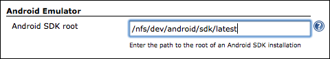

This can either be an absolute path, or can contain environment
variables in the format `$``VARIABLE_NAME`. This will be replaced at
build time from the node's environment variables (see the "Node
Properties" settings for each slave), or from the build's environment.

If no value is entered, or the plugin cannot find a valid SDK under the
configured path, it will search under the following environment
variables on the build node to try and locate a usable SDK:

-   `ANDROID_SDK_ROOT`
-   `ANDROID_SDK_HOME`
-   `ANDROID_HOME`
-   `ANDROID_SDK`

If nothing is found, the plugin will search on the `PATH` to attempt to
locate a usable set of SDK tools. If, after all these steps, the
required Android SDK tools are not found and auto-installation is
disabled, the build will be marked as "not built" and will stop.

### Job configuration

##### Running on headless build machines

If you have build slaves which are headless (e.g. Linux servers that
don't have a graphical user interface), you can still run an Android
Emulator even although, by default, the emulator does require a
graphical environment.

Just untick the "Show emulator window" configuration option in your job
configuration. This is the equivalent of using the emulator's
"`-no-window`" command-line option.

Using an artificial graphical environment...

It is also possible to run the Android emulator UI on a headless build
slave by making use of an artificial X server, such as
[Xvnc](http://www.realvnc.com/products/free/4.1/man/Xvnc.html).

In this case, a recommended setup is to install both Xvnc and the [Xvnc
Plugin](https://wiki.jenkins.io/display/JENKINS/Xvnc+Plugin) for Jenkins.
With this plugin enabled in your job — and Xvnc configured to run
without requesting a password — you can run multiple Android emulators
in parallel on a headless slave, while keeping the "Show emulator
window" option enabled.

Although the Android Emulator plugin has been designed to ensure it
always runs after an Xvnc server has been started, the Xvnc plugin does
not wait for the Xvnc server to be fully up-and-running before handing
control over to the Android Emulator plugin.

For this reason, you may want to delay emulator startup by a few seconds
(e.g. three to five), giving the Xvnc server time to finish starting-up
before attempting to launch an Android emulator into it. To do so, enter
the desired number of seconds in the "Startup delay" field under
"Advanced" options.

##### Other requirements

In addition, while the Android Emulator plugin requires the [Port
Allocator
Plugin](https://wiki.jenkins.io/display/JENKINS/Port+Allocator+Plugin),
there is no job configuration required for this; everything is handled
automatically — you need not select the "Assign unique TCP ports"
checkbox in the job config.

#### Selecting an emulator

After ticking "Run an Android emulator during build", you will be asked
whether you want to run an existing AVD, or whether you want to create a
new one on-the-fly with certain properties.

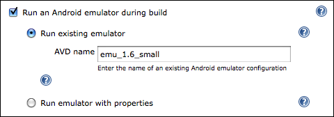

Using an existing emulator for a job just requires that you enter the
name of the AVD you want to be started. This AVD must exist on each
build node the job will be executed on. Existing AVDs are found in your
`$HOME/.android/avd` directory and can be listed using the
"`android list avd`" command.  
As with all other properties, you can enter environment variables here
using the format `$``VARIABLE_NAME`.

Alternatively, if you don't have a particular AVD accessible on each
build node, the plugin can automatically generate a new emulator if one
doesn't already exist:

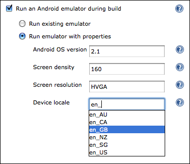

Each property is mandatory, aside from the device locale. If this is not
entered, the Android emulator default locale of US English (en\_US) will
be used when starting the emulator.

Each field will auto-complete with the default Android SDK values, e.g.
120, 160, 240dpi densities and named screen resolutions including QVGA,
HVGA, WVGA etc. However, you can enter your own values if you wish to
use a custom OS image, screen density, resolution or locale.  
Screen resolutions can be entered either using the named values, or as a
"width times height" dimension, e.g. `480x800`.

You can specify multiple hardware properties such as the heap size for
each Android app, or whether the device has a GPS by clicking the button
"Add custom hardware property" and entering the values. See the inline
help for more details on the values to enter.

Using Google Maps and other SDK add-ons...

As mentioned above, the "Android OS version" field will auto-complete to
existing SDK versions such as "1.5" or "2.2".

However, it is possible to enter different values in this field, for
example if you want to use an Android SDK add-on that you have
installed, e.g. the Google APIs add-on or the Samsung GALAXY Tab add-on.

In these cases, just enter the appropriate value given by the
"`android list target`" command. For example:

-   The Google APIs add-on, based on an Android 1.6 emulator:
    `Google Inc.:Google APIs:4`
-   The Samsung GALAXY Tab add-on, based on an Android 2.2 emulator:
    `Samsung Electronics Co., Ltd.:GALAXY Tab Addon:8`

#### Multi-configuration (matrix) job

The real awesomeness of this plugin comes when used in conjunction with
a multi-configuration job type.

By using the "Run emulator with properties" setting, in conjunction with
one-or-more matrix axes and the Android Emulator plugin's variable
expansion, you can generate and test with a large number of distinct
Android emulator configurations with very little effort.

To give a full example, if you want to test your application across
multiple Android OS versions, multiple screen densities, multiple screen
resolutions and for several target locales, you might set up your matrix
axes as follows:

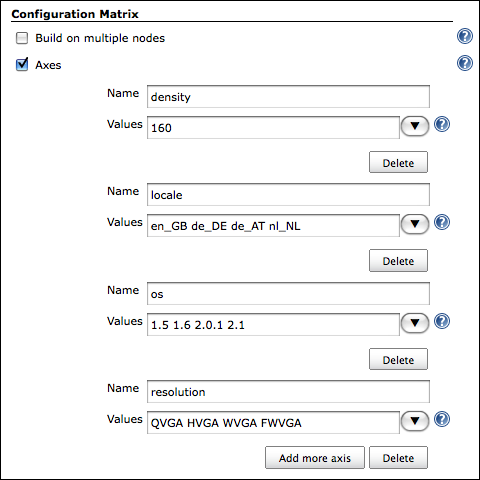

As each of these axis names (i.e. "density", "locale", "os",
"resolution") are exported by Jenkins as environment variables, you can
make use of these when launching a new Android emulator:

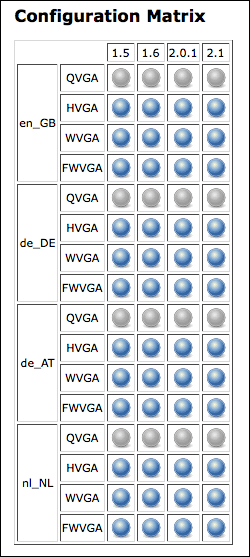  
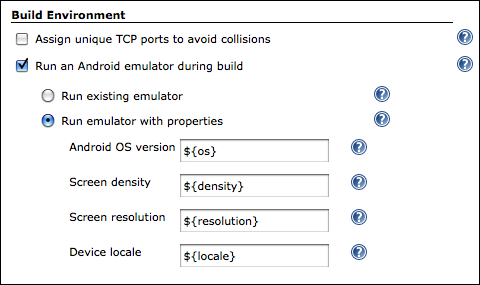

When the build executes, this would automatically generate and allow you
to test your application against 64 unique device configurations.

However, you should note that not **all** combinations are valid. For
example, a WVGA (800x480) resolution device makes no sense with a screen
density of 120 (unless you have superhuman eyesight).

For this purpose, you can use the "Combination Filter" feature, which
tells Jenkins which combinations of the matrix axes are valid. In the
case of screen densities and resolutions, a configuration like this
should instruct Jenkins to only build for [configurations which make
sense](http://developer.android.com/guide/practices/screens_support.html#range):

``` syntaxhighlighter-pre
(density=="120").implies(resolution=="QVGA" || resolution=="WQVGA" || resolution=="FWQVGA") &&
(density=="160").implies(resolution=="HVGA" || resolution=="WVGA" || resolution=="FWVGA") &&
(density=="240").implies(resolution=="WVGA" || resolution=="FWVGA")
```

Note that each variable refers to one of the matrix axes, *not* an
Android Emulator plugin property.

## Build execution

### Environment

For convenience, the plugin places a number of variables into the build
environment relating to the emulator in use:

| Variable name             | Example value                     | Description                                                                               |
|---------------------------|-----------------------------------|-------------------------------------------------------------------------------------------|
| `ANDROID_SERIAL`          | `localhost:34564`                 | Identifier for connecting to this AVD, e.g. `adb -s localhost:34564 shell`                |
| `ANDROID_AVD_DEVICE`      | `localhost:34564`                 | Identifier for connecting to this AVD, e.g. `adb -s localhost:34564 shell`                |
| `ANDROID_AVD_ADB_PORT`    | `34564`                           | Port used by ADB to communicate with the AVD (random for each build)                      |
| `ANDROID_AVD_USER_PORT`   | `40960`                           | Port used to access the AVD's telnet user interface (random for each build)               |
| `ANDROID_AVD_NAME`        | `hudson_en-GB_160_HVGA_android-7` | Name of the AVD running for the build                                                     |
| `ANDROID_AVD_LOCALE`      | `en_GB`                           | Locale of the AVD                                                                         |
| `ANDROID_AVD_OS`          | `2.1`                             | OS version of the running AVD                                                             |
| `ANDROID_AVD_DENSITY`     | `160`                             | Screen density in dpi of the AVD                                                          |
| `ANDROID_AVD_RESOLUTION`  | `HVGA`                            | Screen resolution, named or dimension, of the AVD                                         |
| `ANDROID_AVD_SKIN`        | `HVGA`                            | Skin being used by the AVD, e.g. `WQVGA432` or `480x800`                                  |
| `ANDROID_ADB_SERVER_PORT` | `51292`                           | Port that the AVD server for this build is running on (random for each build)             |
| `ANDROID_TMP_LOGCAT_FILE` | `/var/tmp/logcat_943239.log`      | Temporary file to which logcat output is written during the build (random for each build) |
| `JENKINS_ANDROID_HOME`    | `/home/jenkins/tools/android-sdk` | The path to the Android SDK being used for this build (optional)                          |
| `ANDROID_HOME`            | `/home/jenkins/tools/android-sdk` | The path to the Android SDK being used for this build (optional)                          |

### Using the emulator

Now that you have an Android emulator running, you'll probably want to
install one or more Android applications (APKs) and start running some
tests.

Basically, whenever you want to call `adb` as part of your build, just
call it as you normally would, e.g. `adb install my-app.apk`.

If you're using Android's default Ant build system, you should specify
the `sdk.dir` property, to tell Ant it can find the Android build
scripts:  
Just add "`sdk.dir=$ANDROID_HOME`" to the "Properties" field of your
"Invoke Ant" build step.

Documentation for older plugin versions...

#### Using version 1.18 or older...

Normally, when running an Android application using Eclipse or the
command line, either your APK is automatically installed (because there
is only one emulator/device attached to your PC), or Eclipse allows you
to choose from a list. Similarly, when building from the command line,
installation is done with a command like:
"`adb -e install -r my-app.apk`", where "`-e`" specifies the emulator
(or "`-d`" a USB-attached device).

However, as Jenkins may be running multiple Android-related builds at
once, with several emulators running in parallel, it's not possible to
automatically determine which emulator should be used. Nor can the user
be prompted at build time.

Since version 1.15, the `ANDROID_SERIAL` environment variable has been
automatically set by the plugin. Because the `adb` tool automatically
uses this variable to determine which Android device to communicate
with, you no longer need to pass in parameters like "`-s`" or "`-e`" to
`adb`.

Furthermore, since version 2.13, if the plugin detects (or automatically
installs) your Android SDK, the SDK tools and platform tools directories
will be prepended to your `$PATH` during a build. This means you don't
have to supply the full path to tools like `adb` or `monkeyrunner`, even
if those tools would not normally be on the `$PATH`.

#### Using version 1.14 or older...

##### Working with Android's default Ant build system

The default build system for Android is Apache Ant, which is well
supported by Jenkins.

When calling targets like "`ant install`" or "`ant run-tests`", the
Android build system allows you to use the `adb.device.arg` property to
specify where the application should be installed to.

To make use of this in an "Invoke Ant" build step, just add the
following to your Ant "Properties" section:  
`adb.device.arg="-s $ANDROID_AVD_DEVICE"`

##### Using shell commands

If you aren't using Ant, but want Jenkins to run `adb` commands for you
via an "Execute shell" build step, the process is similar.

To install, use the `ANDROID_AVD_DEVICE` environment variable with the
`-s` flag:  
`adb -s $ANDROID_AVD_DEVICE install -r my-app.apk`

This would be automatically expanded by the shell to something like:  
`adb -s localhost:34564 install -r my-app.apk`

The same principle applies for any other `adb` commands you wish to
perform, for example to start running tests:  
`adb -s $ANDROID_AVD_DEVICE shell am instrument -r -w com.example.tests/android.test.InstrumentationTestRunner | tee test-result.txt`

#### Installing project prerequisites

When compiling an Android project, you must have all the prerequisite
Android platform images installed. For example, if you have an Android
app which relies on an Android library project, plus you have a unit
test project — these may all be targeting different Android SDK
versions, all of which must be present at compile time.

Normally, with the (deprecated) Ant build system, these target versions
are specified in either a "`project.properties`" or
"`default.properties`" file.

Since version 2.1, the plugin provides a "**Install Android project
prerequisites**" build step for the Ant build system, which
automatically detects the target versions in the build workspace, then
automatically installs any of the corresponding Android platform images
that are not yet installed.

This build step requires no configuration — just add it before the build
step that compiles your Android projects.

For the Gradle build system, I would recommend including the [Android
SDK Manager Gradle
Plugin](https://github.com/JakeWharton/sdk-manager-plugin) in your
project. You may have to use [JitPack](https://jitpack.io/) to get the
latest version.

#### Creating project build files

If you only build a project in Eclipse or using another IDE, you may not
have the required Ant build files created or checked into your
repository.

Since version 2.8, the "**Create Android build files**" build step will
automatically find any Android app, library or test projects in a
build's workspace and will create the build files for them, using the
appropriate "`android update project`" command.

#### Installing and uninstalling APKs

Since version 1.9, the plugin can automatically install an APK on the
started emulator for you.

Under the "Build" section of your job configuration, select "Add build
step" and choose "**Install Android package**".

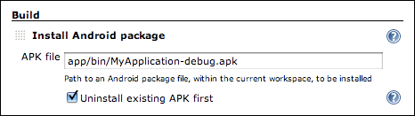

In the "APK file" field that appears, enter the filename of the APK you
wish to install. When a build runs, the APK will be automatically
installed after the emulator has started up.

Note: It is also possible to use this build step without having started
an emulator via this plugin — you can install an APK on an attached
device or other emulator.

#### Running the Android `monkey` tool

The plugin provides a Build Step called "**Run Android monkey tester**"
which will run the
[monkey](https://developer.android.com/guide/developing/tools/monkey.html)
stress-testing tool against the given Android package.

The output is saved to a file — by default "`monkey.txt`" in the root of
the build workspace.  
Don't forget to archive this file by using "Archive the artifacts"
option under "Post-build Actions" if you want to keep the monkey output
for future reference!

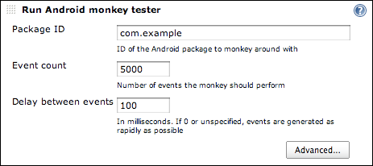

#### Parsing `monkey` output

Also provided is a method of parsing the output of the monkey testing
tool.

Under the "Post-build Actions" section, enable the "**Publish Android
monkey tester result**". No further configuration is required — by
default the plugin will search for "`monkey.txt`" in the root of the
build workspace, parse the file's contents and display the result on the
build page.

If the monkey output reveals your Android application crashed or caused
an "Application Not Responding" situation, the build will be marked as
UNSTABLE.

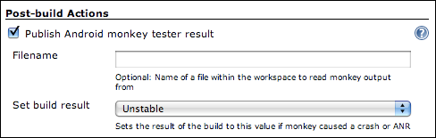

You can, of course, specify a different filename (including the use of
variables) or change the "Set build result" option to mark the build as
a FAILURE rather than just UNSTABLE, or leave its status untouched in
case the monkey information does not indicate success.

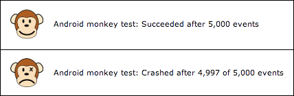

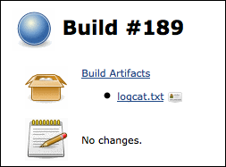

### Artifacts

Once the emulator is ready for use, its log is captured until the build
finishes. This corresponds to the output of "`adb logcat -v time`", i.e.
the main log output including timestamps.  
This will be archived automatically as a build artifact, with the name
`logcat.txt`.

## Known issues

View known issues...

### Pipeline not yet supported

This plugin is currently still only compatible with Freestyle jobs
— Pipeline support is planned!

### Emulator v2

The new-and-improved emulator engine — first released as part of SDK
Tools 25 (and Android Studio 2.0) — is supported as of version 3.0 of
this plugin.

However, the Quick Boot feature (formerly known as snapshots) is
currently not supported, as the command line tools do not appear to
support this.

### Android SDK Tools

Due to a regression in SDK Tools r12 and r13 (see [Android bug
\#18444](http://b.android.com/18444)), running any builds with the "Use
emulator snapshots" option enabled (which is the default), would likely
fail to load in the state you expect. For example the emulator may not
be ready for use, and the screen may not be unlocked.

To avoid this, either keep using r11 or earlier, or update to r14 or
newer. However, if you update, you will have to manually delete all
existing snapshot images and allow this plugin to re-create them.  
See the [Known Issues](http://tools.android.com/knownissues) page on the
Android Tools site for more information.

Similarly, snapshot support does not fully function for Android 4.0
until SDK Tools r15. An initial snapshot can be created, but
subsequently loading from that snapshot will crash the emulator
immediately. Earlier Android versions are not affected, i.e. you can
still use snapshots with Android 3.2 and earlier. Upgrading to SDK Tools
r15+ should fix this.

As a workaround, you can also uncheck "Use emulator snapshots" in any
jobs where you are seeing problems.

### Running in a Windows service as "Local System"

New AVDs cannot be generated and run if Jenkins is running as a Windows
service, using the "Local System" account (see
[JENKINS-7355](https://issues.jenkins-ci.org/browse/JENKINS-7355)).

-   Workaround: configure the Jenkins service to "run as" a real user

### Emulator UI doesn't appear when running on Windows 7

If running Jenkins as a service on Windows 7 or newer, you may find that
while the plugin can start an emulator, its user interface may not
appear, even if configured to do so.  
This is due to something called Session 0 Isolation, which prevents
services from starting UIs for security reasons.

If you really need to see the emulator UI, you can either run Jenkins
not as a service, or add a slave node to Jenkins (e.g. launch slave via
JNLP on the same machine) which will bypass this isolation.

### Unexpected timeouts or hanging during build

AVDs can, on occasion, time-out unexpectedly or stop responding during a
build, e.g. when trying to install an APK (see
[JENKINS-7354](https://issues.jenkins-ci.org/browse/JENKINS-7354)).

-   This is generally caused by bugs in the ADB process. It can be prone
    to hanging or crashing. Over time, more safeguards have been added
    to the plugin, including timing-out after a while and isolating ADB
    instances, so this shouldn't happen too often.

This should also be more stable with version 3.0 of this plugin, which
allows the new emulator engine to be used.

### AVDs may not shut down fully at the end of a build

Sometimes the `emulator` process does not shut down fully at the end of
a build (requiring a `kill -9` on Linux); the plugin sends a [console
command to terminate the
emulator](https://developer.android.com/guide/developing/devices/emulator.html#terminating)
and the UI window closes, but the actual `emulator` process does not
die.

-   This issue will be fixed once
    [JENKINS-11995](https://issues.jenkins-ci.org/browse/JENKINS-11995)
    is implemented.
-   If your slave is running Linux, you may be running into [Android
    issue \#17294](http://b.android.com/17294)  
    In this case, there is a workaround assuming your build doesn't need
    to use the emulator's audio input:
    -   Add a custom hardware property called "`hw.audioInput`" with the
        value "`no`"

## Potential upcoming features

-   Support for the [Pipeline
    Plugin](https://wiki.jenkins.io/display/JENKINS/Pipeline+Plugin) is
    planned
-   Within the 'android-emulator' component of Jenkins' issue tracker
    you can:
    -   [Add a new feature
        request](https://issues.jenkins-ci.org/secure/CreateIssueDetails!init.jspa?Create=Create&pid=10172&priority=4&assignee=-1&components=15725&issuetype=2)
    -   [View existing
        requests](https://issues.jenkins-ci.org/secure/IssueNavigator.jspa?reset=true&jqlQuery=project+%3D+JENKINS+AND+issuetype+in+%28%22New+Feature%22%2C+Improvement%29+AND+component+%3D+android-emulator-plugin+AND+status+in+%28Open%2C+%22In+Progress%22%2C+Reopened%29)

## Version history

### Version 652.v185536c05086 (November 12, 2024)

-👷 Changes for plugin developers
   - fix(maven): Revert incrementals. (#222) @gounthar

### Version 651.v471170b_2a_734 (November 12, 2024)

- 🚀 New features and improvements
  - fix(maven): Incrementals. (#221) @gounthar
- 🐛 Bug fixes
  - fix(maven): Incrementals. (#221) @gounthar
  - Update Android SDK command line tools to version 12.0 (#219) @nfalco79
- 👷 Changes for plugin developers
  - fix(maven): Incrementals. (#221) @gounthar
- ✍ Other changes
    - chore(maven): Move the BOM to the latest baseline. (#220) @gounthar
  - chore(dependencies): From weekly to LTS (#218) @gounthar
  - Update Jenkins Security Scan action (#213) @strangelookingnerd
  - Enable Jenkins Security Scan (#208) @strangelookingnerd
  - Fix 'escape-by-default' XML PI (#207) @daniel-beck
  - Updates pom.xml to depend on commons-lang3-api and exclude commons-lang3 where it is brought in transitively. (#180) @gounthar
  - Plugin modernization (#179) @gounthar
  - Test with Java 21, dependencies clean-up and modernization. (#173) @gounthar
  - chore(build): Tests on JDK21. (#169) @gounthar

### Version 592.vb_b_6d427f1923 (July 21, 2023)

- 🐛 Bug fixes
  - Increase core baseline (#153) @basil
- 👻 Maintenance
  - Remove usages of Prototype (#152) @basil
  - Refresh plugin for July 2023 (#151) @basil
- ✍ Other changes
  - fix(cd): tag should match ${scmTag}, in the best case (#159) @gounthar
  - fix(cd): Fully automatic versioning (#158) @gounthar
  - fix(releases): Setting up automated plugin release (#157) @gounthar
  - feature(release): Setting up automated plugin release (#156) @gounthar
  - Create release-drafter.yml (#155) @gounthar
  - fix(documentation): Fixes misprints (#154) @gounthar
  - chore(deps): bump plugin from 4.64 to 4.66 (#144) @dependabot
  - chore(deps): bump plugin from 4.63 to 4.64 (#143) @dependabot
  - chore(deps): bump plugin from 4.58 to 4.59 (#133) @dependabot
  - Bump bom-2.361.x from 1742.vb_70478c1b_25f to 1750.v0071fa_4c4a_e3 (#110) @dependabot
  - Bump plugin from 4.51 to 4.53 (#109) @dependabot
  - Bump bom-2.346.x from 1723.vcb_9fee52c9fc to 1742.vb_70478c1b_25f (#108) @dependabot
  - Bump bom-2.346.x from 1706.vc166d5f429f8 to 1723.vcb_9fee52c9fc (#106) @dependabot
  - [SECURITY] Fix Temporary File Information Disclosure Vulnerability (#103) @JLLeitschuh
  - Bump plugin from 4.50 to 4.51 (#105) @dependabot
  - Bump bom-2.346.x from 1678.vc1feb_6a_3c0f1 to 1706.vc166d5f429f8 (#104) @dependabot
  - Bump plugin from 4.49 to 4.50 (#102) @dependabot
  - Bump bom-2.346.x from 1670.v7f165fc7a_079 to 1678.vc1feb_6a_3c0f1 (#101) @dependabot
  - Bump spotbugs-maven-plugin from 4.7.2.2 to 4.7.3.0 (#100) @dependabot
  - Bump spotbugs-maven-plugin from 4.7.2.1 to 4.7.2.2 (#99) @dependabot
  - Bump bom-2.346.x from 1654.vcb_69d035fa_20 to 1670.v7f165fc7a_079 (#98) @dependabot
  - Bump bom-2.346.x from 1643.v1cffef51df73 to 1654.vcb_69d035fa_20 (#97) @dependabot
  - Bump plugin from 4.48 to 4.49 (#96) @dependabot
  - Bump apk-parser from 2.2.1 to 2.6.10 (#90) @dependabot
  - Bump assertj-core from 3.15.0 to 3.23.1 (#89) @dependabot
  - Bump spotbugs-maven-plugin from 4.7.2.0 to 4.7.2.1 (#92) @dependabot
  - chore(gitpod) Move to gitpod. (#95) @gounthar
  - Bump bom-2.346.x from 1607.va_c1576527071 to 1643.v1cffef51df73 (#93) @dependabot
  - Bump plugin from 4.47 to 4.48 (#91) @dependabot
  - Use most recent parent pom (#94) @gounthar
  - Automate dependency updates (#88) @gounthar
  - Use https: for scm URL, not git: (#87) @gounthar
  - Require 2.346.3 as minimum Jenkins version (#86) @gounthar
  - Replaced deprecated Util.copy with built-in java function (#84) @StefanSpieker
  - Tables to Divs migration in order to be compatible with new jenkins v… (#83) @sorobon

### Version 3.1.1 (August 2, 2020)

- Bugfixes
  - JENKINS-36174 Fix default value on plugin update
  - Fix minor UI issue and alignement

### Version 3.1 (August 2, 2020)

- Bugfixes
  - [JENKINS-36174](https://issues.jenkins-ci.org/browse/JENKINS-36174) Make ADB connection timeout configurable
- Improvements
  - [JENKINS-61782](https://issues.jenkins-ci.org/browse/JENKINS-61782) Latest Android SDK command line tools package is not supporte
  - [JENKINS-51197](https://issues.jenkins-ci.org/browse/JENKINS-51197) Auto-Installation does not work if latest build-tools are an RC version

### Version 3.0 (December 4, 2017)

Many thanks to [Michael Musenbrock](https://github.com/redeamer) for
doing most of the heavy lifting on this release.

-   Added support for Android Emulator 2.0
    ([JENKINS-40178](https://issues.jenkins-ci.org/browse/JENKINS-40178),
    [JENKINS-43215](https://issues.jenkins-ci.org/browse/JENKINS-43215),
    [JENKINS-44490](https://issues.jenkins-ci.org/browse/JENKINS-44490))

    -   The QEMU2 engine will be used automatically, and should be
        faster and more stable

    -   Older SDK Tools will be automatically upgraded to a modern
        version as appropriate

    -   Fixed creation of non-default ABI images with SDK Tools \< 25.3
        ([JENKINS-32737](https://issues.jenkins-ci.org/browse/JENKINS-32737))

    -   Thanks to Michael Musenbrock

-   Fixed to select the configured emulator executable when listing
    snapshots
    ([JENKINS-34678](https://issues.jenkins-ci.org/browse/JENKINS-34678))

    -   Thanks to [Karol Wrótniak](https://github.com/koral--)

-   Updated to non-deprecated artifact archiving mechanism
    ([JENKINS-26941](https://issues.jenkins-ci.org/browse/JENKINS-26941))

    -   Thanks to [Tarek Belkahia](https://github.com/tokou)

-   Added configuration-time check for application ID in the APK
    uninstall step ([PR
    \#53](https://github.com/jenkinsci/android-emulator-plugin/pull/53))

    -   Thanks to [Sung Kim](https://github.com/hunkim)

-   Fixed Findbugs warnings, reduced other warnings, and removed
    deprecated code usages
    ([JENKINS-45456](https://issues.jenkins-ci.org/browse/JENKINS-45456))

    -   Thanks to Michael Musenbrock

-   Added a Jenkinsfile for [ci.jenkins.io](https://ci.jenkins.io/)

-   Updated minimum Jenkins version to 2.32

### Version 2.15 (May 23, 2016)

-   Ensure that newer emulators aren't left running when a build
    completes
    ([JENKINS-35004](https://issues.jenkins-ci.org/browse/JENKINS-35004))
    -   This is required as SDK Tools 25.1.6 introduced a breaking
        change to the emulator console interface

### Version 2.14.1 (April 20, 2016)

-   Fix crash when using named emulators
    ([JENKINS-34152](https://issues.jenkins-ci.org/browse/JENKINS-34152))
-   Updated names and inline help for build steps that create project
    build files or install prerequisites, to mention that these only
    work for the deprecated Ant build system

### Version 2.14 (April 8, 2016)

-   Fixed severe reliability issues when multiple emulators were running
    at the same time
-   Improved emulator startup detection to be more reliable
    -   Thanks to Andy Piper
-   Prevented emulators from using the new QEMU2 engine, which is
    missing required features (e.g. Android bugs
    [\#202762](http://b.android.com/202762),
    [\#202853](http://b.android.com/202853),
    [\#205202](http://b.android.com/205202),
    [\#205204](http://b.android.com/205204),
    [\#205272](http://b.android.com/205272))
-   Ensured that the screen density is configured when creating an
    emulator
-   Added the ability to use the dedicated screen unlock command on
    Android 6+
    ([JENKINS-30849](https://issues.jenkins-ci.org/browse/JENKINS-30849))
-   Implemented [master-agent access
    control](https://wiki.jenkins.io/display/JENKINS/Slave+To+Master+Access+Control)
-   When auto-installing the Android SDK, version 24.4.1 is now used
-   Added support for newer screen densities that are in use (400, 420,
    560dpi)
-   Added support for Android 6.0

### Version 2.13.1 (April 9, 2015)

-   Fixed an issue where the plugin would prematurely declare that an
    emulator had fully started up
    ([JENKINS-27702](https://issues.jenkins-ci.org/browse/JENKINS-27702))
    -   Thanks to Mads Kalør

### Version 2.13 (March 12, 2015)

-   Reverted to the "localhost:XXXX" style of connecting to emulators,
    as using "emulator-XXXX" seemed to be a very common cause of
    emulator startup failures
    ([JENKINS-11952](https://issues.jenkins-ci.org/browse/JENKINS-11952))
-   Fixed inability to launch Android tools on Unix slaves from a
    Windows master due to a bad path separator
    ([JENKINS-23134](https://issues.jenkins-ci.org/browse/JENKINS-23134))
    -   Thanks to Dave Brown
-   Fixed the naming of emulators using x86-based Google APIs as Google
    changed the naming scheme again
    ([JENKINS-23252](https://issues.jenkins-ci.org/browse/JENKINS-23252))
-   Fixed the naming of emulators due to a change in the ABI naming
    format.
    ([JENKINS-25336](https://issues.jenkins-ci.org/browse/JENKINS-25336))
    -   Thanks to Louis Davin
-   Enabled the automated installation of tagged system images, e.g.
    `android-wear/x86`
-   Fixed issue where starting a named AVD ignored the configured
    emulator executable
    ([JENKINS-26338](https://issues.jenkins-ci.org/browse/JENKINS-26338))
    -   Thanks to Chiara Chiappini
-   Fixed the inability to start an emulator in certain cases on 64-bit
    Mac OS X machines with SDK tools version 23.0.4 or newer
    ([JENKINS-26893](https://issues.jenkins-ci.org/browse/JENKINS-26893))
-   Switched to using "init.svc.bootanim" to more reliably detect boot
    completion, where appropriate
    ([JENKINS-22555](https://issues.jenkins-ci.org/browse/JENKINS-22555))
-   Removed reliance on the `aapt` tool and the unreliable detection
    code surrounding it
-   APK install/uninstall build steps now wait for the system package
    manager to be available before trying to do anything
-   Added timeouts to APK install/uninstall build steps as it's not
    uncommon that `adb` hangs during installation (e.g. [Android bug
    \#10255](http://b.android.com/10255))
-   Added timeouts to `adb` when attempting to unlock the screen after
    boot
-   Increased minimum Jenkins requirement to 1.565.1 to get a crash fix
    important for Java 8 users
    ([JENKINS-21341](https://issues.jenkins-ci.org/browse/JENKINS-21341))
-   Added option to run monkey on multiple (or no) packages or intent
    categories
    ([JENKINS-13559](https://issues.jenkins-ci.org/browse/JENKINS-13559))
    -   Thanks to Mads Kalør
-   Added option to pass extra command line parameters to the monkey
    tool
    ([JENKINS-13559](https://issues.jenkins-ci.org/browse/JENKINS-13559))
-   The SDK tools and platform tools directories of the SDK in use are
    now prepended to `$PATH` during a build
    -   This means you no longer need to specify the full path to `adb`
        in an "Execute shell" build step, for example
-   When auto-installing the Android SDK, version 24.0.2 is now used
-   Added support for Android 5.1

### Version 2.12 (October 21, 2014)

-   Added support for Android 5.0, 64-bit system images, and xxxhdpi
    screen density
-   Fix naming of emulator, so that newer x86 images can be used
    ([JENKINS-23252](https://issues.jenkins-ci.org/browse/JENKINS-23252))
    -   Thanks to Thomas Keller
-   Wait for ADB server to start before starting the emulator
    ([JENKINS-11952](https://issues.jenkins-ci.org/browse/JENKINS-11952))
    -   Should help with cases where the emulator starts faster than the
        ADB server
    -   Thanks to Richard Mortimer

### Version 2.11.1 (May 19, 2014)

-   Added support for Android 4.3 and 4.4

### Version 2.11 (May 18, 2014)

-   Fixed problem connecting to ADB with non four-digit port numbers
    ([JENKINS-12821](https://issues.jenkins-ci.org/browse/JENKINS-12821),
    [JENKINS-20819](https://issues.jenkins-ci.org/browse/JENKINS-20819))
    -   This should enable connecting to emulators from the
        android-maven-plugin
    -   Thanks to Richard Mortimer
-   Use "emulator" instead of "localhost" when connecting to emulators
    ([JENKINS-12821](https://issues.jenkins-ci.org/browse/JENKINS-12821),
    [JENKINS-22334](https://issues.jenkins-ci.org/browse/JENKINS-22334))
    -   This should fix strange connection failures or multiple devices
        which started appearing in recent SDK tools versions
    -   Thanks to Richard Mortimer
-   Added support for build-tools so that aapt can be located in newer
    SDKs
    ([JENKINS-18584](https://issues.jenkins-ci.org/browse/JENKINS-18584))
    -   Thanks to Steve Moyer
-   Work around [Android bug \#34233](http://b.android.com/34233) when
    parsing the snapshot list
    -   Thanks to Matt McClure
-   Fixed parsing of snapshot list, for snapshots larger than 1GB
    -   Thanks to Matt McClure
-   Fixed automated opt-out of usage statistics
    ([JENKINS-14557](https://issues.jenkins-ci.org/browse/JENKINS-14557),
    [JENKINS-21280](https://issues.jenkins-ci.org/browse/JENKINS-21280))
    -   Thanks to Matt McClure
-   Increased emulator startup timeout from 180 to 360 seconds
    -   Thanks to Matt McClure
-   Fixed parsing of relative paths on Windows
    ([JENKINS-18970](https://issues.jenkins-ci.org/browse/JENKINS-18970)).
    -   Thanks to Aitor Mendaza-Ormaza
-   Accept multi-line properties when parsing project.properties files
    ([JENKINS-22530](https://issues.jenkins-ci.org/browse/JENKINS-22530))
    -   Thanks to xstex
-   Allow adding a suffix to generated AVD names
    ([JENKINS-11083](https://issues.jenkins-ci.org/browse/JENKINS-11083))
    -   This makes it possible to use the exact same emulator config in
        two jobs without one job having to block waiting for the other
        job to finish using the emulator.
    -   Thanks to Hasan Hosgel and Payman Delshad
-   Fixed paths to ensure the inline help text should always be properly
    displayed
    ([JENKINS-20303](https://issues.jenkins-ci.org/browse/JENKINS-20303))
-   Ensure that system images are installed in all cases where required
    ([JENKINS-17532](https://issues.jenkins-ci.org/browse/JENKINS-17532))
-   Ensure that named AVDs still work, even when "keep AVDs in
    workspace" is enabled
    ([JENKINS-18919](https://issues.jenkins-ci.org/browse/JENKINS-18919))
-   Ensure the "Create project files" build step always imports or
    installs an Android SDK
-   Emulator window is no longer shown by default
-   Emulator snapshots are no longer enabled by default as they are not
    very reliable
    ([JENKINS-17126](https://issues.jenkins-ci.org/browse/JENKINS-17126))
-   Don't allow multiple jobs to block each other, if they use build
    parameters to set emulator properties
-   Removed incorrect warnings about potentially incorrect
    density/resolution configuration
    ([JENKINS-13313](https://issues.jenkins-ci.org/browse/JENKINS-13313))
-   When auto-installing the Android SDK, version 22.6.2 is now used
-   Explicitly added MIT licence to the project config
    ([JENKINS-20009](https://issues.jenkins-ci.org/browse/JENKINS-20009))

### Version 2.10 (June 3, 2013)

-   Fixed problems with Android 2.3.3 emulators caused by renaming the
    x86 ABI package
    ([JENKINS-14741](https://issues.jenkins-ci.org/browse/JENKINS-14741))
-   Licence agreements are accepted when auto-installing SDK components
    ([JENKINS-17997](https://issues.jenkins-ci.org/browse/JENKINS-17997))
-   Fixed auto-detection of the SDK in PATH
    ([JENKINS-17816](https://issues.jenkins-ci.org/browse/JENKINS-17816))
-   Updated SDK auto-detection to handle the new 'build-tools' SDK
    component
    ([JENKINS-18015](https://issues.jenkins-ci.org/browse/JENKINS-18015))
-   Various new components are now automatically installed along with
    the SDK
    -   Build Tools
    -   Android and Google local m2 repositories for use with Gradle
        builds
-   When auto-installing the Android SDK, version 21.0.1 is now used

### Version 2.9.1 (April 12, 2013)

-   Fixed a regression in 2.9 which could cause problems running `adb`
    from certain build steps

### Version 2.9 (April 11, 2013)

-   Improved detection of app project when creating build files for a
    test project
    ([JENKINS-17531](https://issues.jenkins-ci.org/browse/JENKINS-17531))
-   ABI field is now ignored when creating emulators which don't support
    ABIs
    ([JENKINS-14741](https://issues.jenkins-ci.org/browse/JENKINS-14741))
-   Resolved issue when automatically installing SDK on a slave
    ([JENKINS-16720](https://issues.jenkins-ci.org/browse/JENKINS-16720))
-   Builds can now be failed if package installation fails
    ([JENKINS-13932](https://issues.jenkins-ci.org/browse/JENKINS-13932))
-   Builds can now be failed if package uninstallation fails
    ([JENKINS-16246](https://issues.jenkins-ci.org/browse/JENKINS-16246))
-   SD card value in matrix jobs is no longer altered when saving
    configuration
    ([JENKINS-13931](https://issues.jenkins-ci.org/browse/JENKINS-13931))
-   Set LD\_LIBRARY\_PATH for emulator to run on 64-bit Linux
    ([JENKINS-14901](https://issues.jenkins-ci.org/browse/JENKINS-14901))
-   Added environment variable pointing to temporary logcat file during
    a build
    ([JENKINS-12572](https://issues.jenkins-ci.org/browse/JENKINS-12572))
-   Added documentation for 'Create Android build files' step
    ([JENKINS-17456](https://issues.jenkins-ci.org/browse/JENKINS-17456))
-   Raised required Jenkins version to 1.466; Hudson is no longer
    supported

### Version 2.8.1 (February 11, 2013)

-   Fix issues with "Create Android build files" build step when running
    on slaves, or on projects in the workspace root
-   Updated all links to android.com in the inline help, since Android
    moved some pages without redirecting the URL (see
    [JENKINS-14860](https://issues.jenkins-ci.org/browse/JENKINS-14860))

### Version 2.8 (February 1, 2013)

-   Add build step which creates Android build files for app, library
    and test projects
-   When auto-installing the Android SDK, now a more up-to-date version
    is installed (20.0.1)

View older versions...

### Version 2.7.1 (November 29, 2012)

-   Fixed bug where emulators couldn't be launched with older SDK
    versions
    ([JENKINS-15967](https://issues.jenkins-ci.org/browse/JENKINS-15967))
    -   Thanks to Jørgen Tjernø

### Version 2.7 (November 26, 2012)

-   Fixed missing icons for monkey results
    ([JENKINS-15903](https://issues.jenkins-ci.org/browse/JENKINS-15903))
-   Add ability to specify `emulator` executable
    -   Thanks to Jan Berkel
-   Added support for Android 4.2 and the xxhdpi screen density
    -   Thanks to Hisayoshi Suehiro

### Version 2.6 (October 10, 2012)

-   Updates relating to use of the "Install Android project
    prerequisites" build step:
    -   Android SDK and tools will now be automatically installed, if
        required
    -   System images for a given platform won't be installed when not
        necessary
-   The name of the system image used is now included in the AVD name
    ([JENKINS-14740](https://issues.jenkins-ci.org/browse/JENKINS-14740))
-   Variables are now expanded in the "Target ABI" field
-   Fixed serialisation issue which could cause SDK install to fail on
    some setups
    ([JENKINS-13420](https://issues.jenkins-ci.org/browse/JENKINS-13420))
    -   Thanks to Kohsuke Kawaguchi

### Version 2.4 (September 17, 2012)

-   Fixed SDK version string parsing for preview builds of the Android
    SDK tools
    ([JENKINS-15097](https://issues.jenkins-ci.org/browse/JENKINS-15097))
    -   Thanks to Ryan Campbell
-   Added support for Android 4.1

### Version 2.3 (July 25, 2012)

-   Fixed SDK version string parsing, now that Android SDK tools uses a
    "major.minor.patch" format
    ([JENKINS-14497](https://issues.jenkins-ci.org/browse/JENKINS-14497))
    -   Thanks to Jan Berkel
-   Which ABI to use when creating an emulator can now be specified
    ([JENKINS-13906](https://issues.jenkins-ci.org/browse/JENKINS-13906))
    -   Thanks to Jan Berkel
-   Added global configuration option which causes emulators to be
    created in a job's workspace
    ([JENKINS-11973](https://issues.jenkins-ci.org/browse/JENKINS-11973))
    -   This allows jobs to be run concurrently on the same slave, and
        the ability to use identical emulator configurations in multiple
        jobs. Generated emulators can also be easily removed by wiping
        out the workspace
    -   Thanks to Jørgen Tjernø

### Version 2.2 (March 27, 2012)

-   Made automated component installation compatible with changes in SDK
    Tools r17
-   System images can now be automatically installed for all platforms,
    not just add-ons
-   Corrupt AVDs are now automatically re-created and creation errors
    are better handled
    ([JENKINS-12120](https://issues.jenkins-ci.org/browse/JENKINS-12120))
-   Snapshot-enabled jobs now get a clean SD card image for each build
    ([JENKINS-13205](https://issues.jenkins-ci.org/browse/JENKINS-13205))
-   Allowed static resources such as icons to be cached properly

### Version 2.1 (January 19, 2012)

-   Added new build step which can install prerequisites for any Android
    projects in the workspace
-   Android SDK is now automatically installed if required by a build
    step (and auto-install is enabled)
-   Prevented platforms from being possibly downloaded redundantly when
    installing SDK add-ons
-   Prevented "Send usage statistics to Google" dialog appearing for
    each build
    ([JENKINS-12326](https://issues.jenkins-ci.org/browse/JENKINS-12326))
-   Increased emulator startup timeout, to help Windows machines
    ([JENKINS-11014](https://issues.jenkins-ci.org/browse/JENKINS-11014))
-   Exposed ANDROID\_HOME environment variable pointing to the Android
    SDK in use
    ([JENKINS-12325](https://issues.jenkins-ci.org/browse/JENKINS-12325))

### Version 2.0 (December 26, 2011)

-   Added automated installation of Android SDK, build tools and OS
    images
    -   Where the SDK is already installed, prerequisites can be
        automatically installed, e.g. OS images, SDK add-ons
    -   Automated installation of Android 4.0 system images will be
        possible when SDK Tools r17 is released (see [Android bug
        \#21880](http://b.android.com/21880))
    -   HTTP proxy support is not yet included
    -   Thanks to Raphaël Moll at Google for implementing our feature
        requests!
-   Each build now runs its own instance of ADB, giving more stability
    and prevents ADB crashes from affecting parallel builds
    ([JENKINS-10148](https://issues.jenkins-ci.org/browse/JENKINS-10148))
    -   Thanks to Jørgen Tjernø for the idea and patch!
-   Added option to delete the emulator when a build ends
-   Added detection of missing ABIs (e.g. required for Android 4.0+)
    ([JENKINS-11516](https://issues.jenkins-ci.org/browse/JENKINS-11516))
-   Added support for Android 4.0.3
-   Relaxed the rules for determining whether a screen resolution alias
    is valid or not
-   More hints are given at configuration time to help ensure an
    appropriate screen resolution is entered
-   Fixed variable expansion where an existing environment variable
    clashed with a build variable
-   Temporary log files are now stored outside of the workspace
    ([JENKINS-11492](https://issues.jenkins-ci.org/browse/JENKINS-11492))
-   Connections to the emulator are now made via TCP, which makes
    startup from snapshot more stable
    ([JENKINS-11952](https://issues.jenkins-ci.org/browse/JENKINS-11952))
-   Made snapshot more likely to succeed on Windows

### Version 1.18 (September 12, 2011)

-   Fixed bug introduced by Android SDK Tools r12, where emulator
    startup was not detected properly on Windows
    ([JENKINS-10815](https://issues.jenkins-ci.org/browse/JENKINS-10815))
-   Fixed bug where build would get stuck during emulator startup if
    `adb` hangs
    ([JENKINS-10421](https://issues.jenkins-ci.org/browse/JENKINS-10421))
    -   Thanks to Jørgen Tjernø
-   Fixed bug where logcat processes were not always killed at the end
    of a build
    ([JENKINS-10785](https://issues.jenkins-ci.org/browse/JENKINS-10785))
-   Made emulator shutdown more robust and prevent builds from hanging
    if the emulator is unresponsive
    ([JENKINS-10778](https://issues.jenkins-ci.org/browse/JENKINS-10778))
    -   Thanks for Richard Mortimer for the investigation and fixes

### Version 1.17 (August 25, 2011)

-   Added ability to use variables when specifying the package ID to run
    monkey against
-   Minor monkey fixes and improvements

### Version 1.16 (August 19, 2011)

-   Added support for Android 3.2
-   Added ability to specify the psuedo-random seed value used when
    running monkey (including random and time-based values)
    -   Thanks to Jan Berkel
-   Stopped redundant logcat output from being included for each build
    when using snapshots
    ([JENKINS-9831](https://issues.jenkins-ci.org/browse/JENKINS-9831))
-   Changed startup behaviour to allow manual management of snapshots
    while the emulator is running
    ([JENKINS-10422](https://issues.jenkins-ci.org/browse/JENKINS-10422))

### Version 1.15 (May 20, 2011)

-   Added support for Android 3.1
-   Export ANDROID\_SERIAL environment variable, making it easier to use
    `adb`
    ([JENKINS-9692](https://issues.jenkins-ci.org/browse/JENKINS-9692))
-   Fixed bug where an APK with spaces in its filename could not be
    installed
    ([JENKINS-9700](https://issues.jenkins-ci.org/browse/JENKINS-9700))
-   Fixed regression in config UI, where checkbox states weren't shown
    properly
    ([JENKINS-9747](https://issues.jenkins-ci.org/browse/JENKINS-9747))

### Version 1.14 (May 13, 2011)

-   Added logic to ensure multiple builds which need the same AVD will
    not run in parallel on the same machine (see
    [JENKINS-7353](https://issues.jenkins-ci.org/browse/JENKINS-7353))
    -   Thanks to Kohsuke Kawaguchi and Andrew Bayer for the assistance
-   Added new build step that runs the
    [monkey](https://developer.android.com/guide/developing/tools/monkey.html)
    testing tool on an emulator or device
-   Added a result publisher that parses monkey tool output, publishes a
    summary on the build page and updates the build result accordingly

### Version 1.13 (Apr 20, 2011)

-   Fixed bug where snapshots would not function with "Show window"
    disabled (see
    [JENKINS-9462](https://issues.jenkins-ci.org/browse/JENKINS-9462))
    -   Thanks to Valdis Rigdon

### Version 1.12 (Apr 08, 2011)

-   Fixed bug which caused creation of a brand new emulator to fail if
    snapshots were enabled

### Version 1.11 (Apr 07, 2011)

-   Added automated reconnection of the emulator to ADB during startup,
    in case ADB crashes (see
    [JENKINS-7693](https://issues.jenkins-ci.org/browse/JENKINS-7693))
-   Now connects to ADB in the same way that manually-started emulators
    do, potentially also improving stability

### Version 1.10 (Apr 04, 2011)

-   Added automated support for emulator snapshots (added in [SDK Tools
    r9](http://tools.android.com/recent/emulatorsnapshots)), which
    enables *much* faster start-up times
-   Fixed bug which could prevent jobs from starting when SDK Tools
    version r7 or older was installed

### Version 1.9 (Mar 06, 2011)

-   Added new build step that can install an APK on an emulator or
    device
-   Added new build step that can uninstall an APK from an emulator or
    device

### Version 1.8.1 (Feb 23, 2011)

-   Added support for Android 3.0, including WXGA resolution (1280x800)
    and new locales

### Version 1.8 (Feb 21, 2011)

-   Added ability to set custom hardware properties such as device RAM,
    Dalvik heap size, keyboard present etc. (see
    [JENKINS-8124](https://issues.jenkins-ci.org/browse/JENKINS-8124))

### Version 1.7 (Feb 09, 2011)

-   Added support for Android 2.3.3
-   Improve detection of failures during startup, plus improved logging
    and minor cleanups

### Version 1.6 (Dec 26, 2010)

-   Added ability to set arbitrary command line options when starting
    the emulator (see
    [JENKINS-8125](https://issues.jenkins-ci.org/browse/JENKINS-8125))

### Version 1.5 (Dec 17, 2010)

-   Added support for Android 2.3 and the xhdpi screen density
-   Added detection to handle the new "platform-tools" directory used in
    SDK Tools r8
-   Added detection of when AVD creation fails due to the desired
    platform not being installed
-   Improved automated emulator unlocking to be more reliable,
    particularly on slower machines
-   Fixed bug which could cause build to hang when trying to shut-down
    the emulator

### Version 1.4 (Sep 28, 2010)

-   Added feature to automatically unlock emulator after startup has
    completed (see
    [JENKINS-7185](https://issues.jenkins-ci.org/browse/JENKINS-7185))
-   Now tries to shut down emulator instances in a cleaner (hopefully
    more reliable) fashion

### Version 1.3.1 (Sep 01, 2010)

-   Fixed bug that prevented custom screen resolutions from being
    recognised (see
    [JENKINS-7337](https://issues.jenkins-ci.org/browse/JENKINS-7337))
-   When verifying whether an AVD exists, ensure we check the same
    directory that the `android` tool creates AVDs in
    -   It was possible in some environments (more likely Windows) that
        this was not the case

### Version 1.3 (Jul 18, 2010)

-   Added ability to control whether AVDs have an SD card, and its size
-   Added option to reset emulator to its default state before each
    build
-   Added option allowing emulator UI to be hidden during a build
-   Added option to delay emulator start-up by a configurable period,
    e.g. to allow a VNC server to start up (see
    [JENKINS-6912](https://issues.jenkins-ci.org/browse/JENKINS-6912))

### Version 1.2 (Jun 17, 2010)

-   Fixed crash that sometimes occurred when creating an emulator.
-   Added more logging and error handling while creating an emulator.
-   Fixed bug that would prevent emulators from starting.
-   Added support for Android 2.2.

### Version 1.1 (May 18, 2010)

-   Added ability to create an AVD using platform add-ons (e.g. the
    Google Maps APIs)
-   Generated AVDs now include a blank SD card image (currently fixed at
    16MB)

### Version 1.0.3 (Apr 06, 2010)

-   Ensure correct environment variables are used when starting the
    emulator. Fixes a problem where the emulator may not start under the
    [Xvnc Plugin](https://wiki.jenkins.io/display/JENKINS/Xvnc+Plugin)

### Version 1.0.2 (Apr 06, 2010)

-   Added environment variables with ADB identifier, ports and skin
    being used
-   Ensured correct skins are used for new AVDs

### Version 1.0.1 (Apr 06, 2010)

-   Fix minor Java 5 compatibility issue

### Version 1.0 (Apr 05, 2010)

-   Initial release

